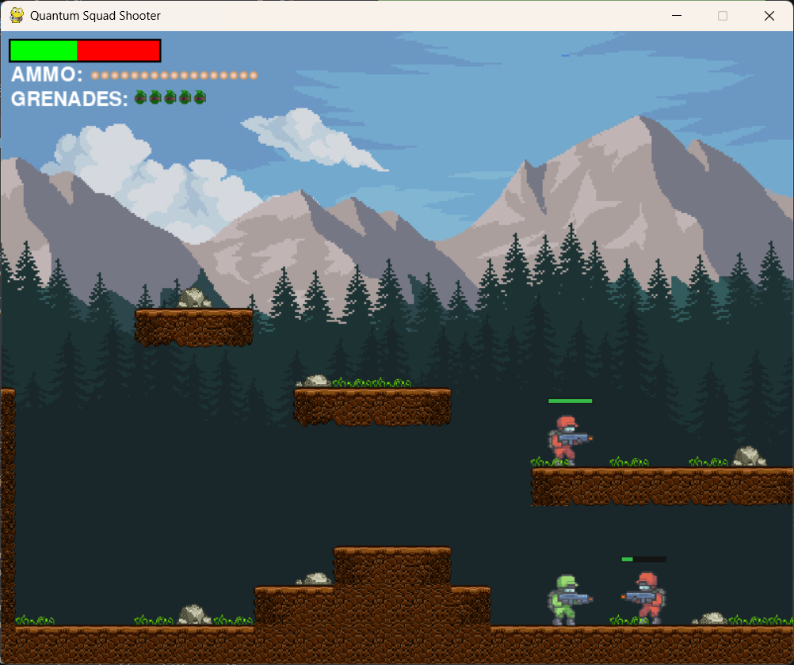
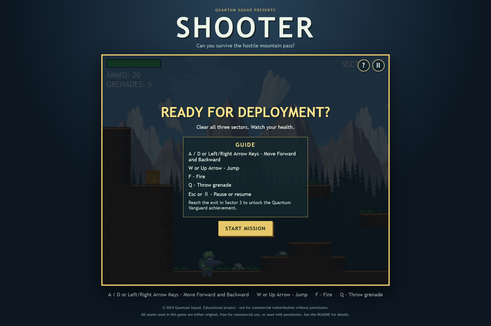
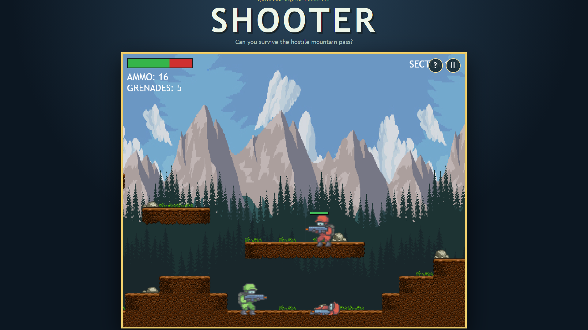

# Quantum Squad Shooter
> (Completed)
Play the game at: 

Quantum Squad Shooter is a 2D side-scrolling action game available as both a
Pygame desktop application and an HTML5 Canvas browser game.








## Repository layout

```text
game/
├── assets/
│   ├── audio/              # Shared sound effects and music
│   ├── images/             # Shared sprites, tiles, backgrounds, and UI art
│   └── levels/             # Shared CSV level definitions
├── desktop/
│   └── code/               # Pygame desktop application
├── web/                    # Static HTML, CSS, JavaScript, and browser config
├── internal-docs/          # Technical architecture and test documentation
├── documentation.md        # Project and gameplay documentation
├── README.md
├── requirements.txt
└── vercel.json
```

## Run the desktop application

```powershell
python -m pip install -r requirements.txt
python desktop/code/main.py
```

## Run the browser version locally

```powershell
python -m http.server 4173
```

Open [http://localhost:4173/web/](http://localhost:4173/web/).

## Deploy to Vercel

Import the repository as an **Other** static project. Set the Vercel **Root
Directory** to the repository root (not `web/`), and leave both the build
command and output directory empty. Push this updated `vercel.json`, then use
**Redeploy** so Vercel serves the CSS, JavaScript, and shared assets correctly.

## Configuration

- Desktop: `desktop/code/shooter/config.py`
- Browser: `web/web-config.js`

## Legal and publishing notice

This is an educational project. Quantum Squad retains rights only in original
work created by the team or materials it is authorised to use. Before publishing
or commercialising the game, confirm that every image, animation, sound effect,
font, code dependency, and trademark has a compatible licence or written
permission for the intended use.

Keep all required attribution and licence notices, do not imply endorsement by
third-party rights holders, and review the terms of any deployment platform.
This is a practical release checklist, not legal advice; obtain qualified legal
advice for a specific jurisdiction or commercial release.

## Colaborators

Team **Quantum Squad**

- Saket Kumar Sinha
- Akshit Goyal
- Ishita Bhatt
- Rhythima Madaan
- Kushagra Goel
- Harsh Sumrav
